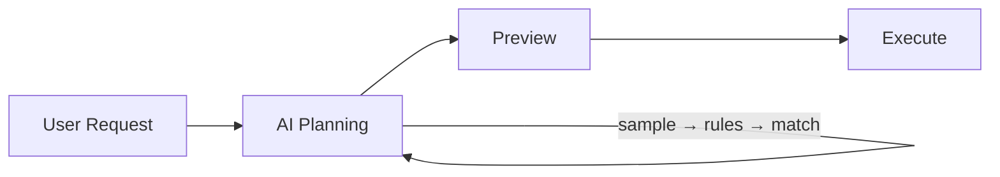
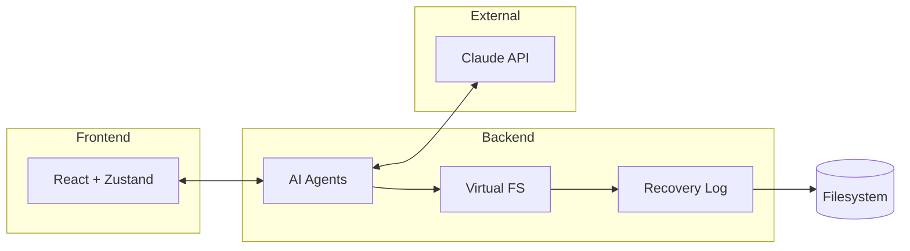
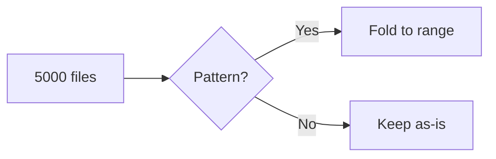
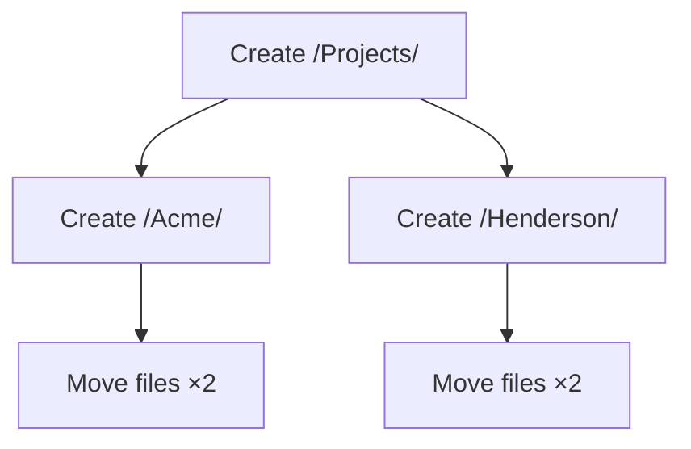

<p align="center">
  
</p>

<h1 align="center">Sentinel</h1>

<p align="center">
  <strong>AI-powered file manager that understands your files</strong>
</p>

<p align="center">
  <a href="#features">Features</a> •
  <a href="#how-it-works">How It Works</a> •
  <a href="#architecture">Architecture</a> •
  <a href="#algorithms">Algorithms</a> •
  <a href="#getting-started">Getting Started</a> •
  <a href="#tech-stack">Tech Stack</a>
</p>

---

Sentinel is a desktop file manager built with Tauri v2 that uses Claude to analyze, organize, and search your files intelligently. Point it at a messy folder, describe what you want, and watch it build an organization plan—then preview every change before anything moves.

## Features

### Conversational File Exploration
Chat with your files. Ask questions like "find all invoices from 2024" or "what's in the contracts folder?" and get answers based on actual file contents, not just names.

```
You: What files here relate to the Henderson project?
Sentinel: I found 12 files across 3 folders:
  - /Documents/Contracts/henderson-agreement.pdf
  - /Projects/Henderson/specs.docx
  - /Downloads/henderson-invoice-*.pdf (3 files)
  ...
```

### Autonomous Organization
Describe how you want files organized. Sentinel analyzes the folder structure, generates rules, and builds a complete reorganization plan.

```
You: Organize this by project, with separate folders for invoices and contracts
Sentinel: I'll create:
  /Projects/
    /Henderson/
      /Invoices/
      /Contracts/
    /Acme/
      /Invoices/
      ...
  Moving 847 files. Ready to preview?
```

### Preview Before Commit
Every operation is simulated in a virtual filesystem first. See exactly what will happen—files highlighted, folders created, conflicts identified—before a single byte moves on disk.

### Crash Recovery
All operations are journaled before execution. If your machine crashes mid-reorganization, Sentinel picks up where it left off or rolls back cleanly.

### Semantic Search
Search files by meaning, not just keywords. "tax documents" finds `1040.pdf`, `w2-2024.pdf`, and `quarterly-estimated.xlsx` even without "tax" in the filename.

## How It Works



The flow is simple: describe what you want → AI builds a plan → preview changes → execute safely.

### Organization Pipeline

1. **Sampling** — For large folders, Sentinel takes a stratified sample (head, tail, median + random per file type) rather than processing every file. A 10,000 file folder uses the same context as a 100 file folder.

2. **Rule Generation** — Claude analyzes samples and generates matching rules in a custom DSL:
   ```
   file.ext IN ['pdf', 'docx'] AND file.name.contains('invoice')
   file.vector_similarity('tax document') > 0.7
   file.modifiedAt > '2024-01-01' AND file.size < 10MB
   ```

3. **Coverage Loop** — Rules are applied iteratively. Unmatched files get re-sampled until 95%+ are covered or max iterations reached.

4. **Simulation** — All moves/creates/deletes are staged in an in-memory VFS. Validation catches conflicts before anything executes.

5. **Execution** — Operations are journaled to a write-ahead log, then executed in parallel via a dependency DAG.

## Architecture



### System Components

| Component | Purpose |
|-----------|---------|
| **Chat Agent** | ReAct loop (max 8 iterations) with tools: `search_hybrid`, `read_file`, `inspect_pattern`, `list_directory` |
| **Organize Agent** | Multi-phase planner with stratified sampling and iterative rule refinement |
| **Rule Engine** | Custom DSL with boolean logic, comparisons, and vector similarity functions |
| **Virtual FS** | In-memory shadow filesystem for safe preview of all operations |
| **WAL** | JSON-based journal with atomic writes and file locking for crash recovery |
| **Execution DAG** | Topological sorting of operations for parallel execution by dependency level |
| **Vector Index** | Local embeddings via fastembed (AllMiniLM-L6-V2) for semantic file search |

## Algorithms

### Adaptive Pattern Folding

Large folders with sequential files (IMG_0001.jpg through IMG_5000.jpg) would explode context windows. Sentinel detects numeric patterns and folds them:

```
Before (5000 tokens):
  IMG_0001.jpg, IMG_0002.jpg, IMG_0003.jpg, ... IMG_5000.jpg

After (50 tokens):
  IMG_[0001..5000].jpg (5000 files, 11.2GB total)
```

**Token savings: 85-94%** for pattern-heavy folders.



### DAG-Based Parallel Execution

Operations form a dependency graph. Folders must exist before files move into them, but independent operations run in parallel.



**Level 0:** Create root → **Level 1:** Create subfolders (parallel) → **Level 2:** Move all files (parallel)

### Coverage-Based Iteration

Rather than processing every file, the organize agent iterates until coverage targets are met:

```
Iteration 1: Sample 60 files → Generate rules → 72% coverage
Iteration 2: Sample 40 unmatched → Refine rules → 89% coverage
Iteration 3: Sample 20 unmatched → Final rules → 96% coverage ✓
```

Max 5 iterations. Each pass only samples from files not yet matched, converging efficiently.

### Model Selection

| File Count | Strategy | Model | Rationale |
|------------|----------|-------|-----------|
| < 300 | Full tree | Haiku | Fast, full context fits |
| 300-5000 | Map-reduce | Sonnet | Rule generation needs reasoning |
| 5000+ | Hologram | Sonnet | Pattern compression + sampling |

## Getting Started

### Prerequisites

- [Rust](https://www.rust-lang.org/tools/install) (1.70+)
- [Node.js](https://nodejs.org/) (18+)
- [Anthropic API Key](https://console.anthropic.com/)

### Installation

```bash
# Clone
git clone https://github.com/yourusername/sentinel.git
cd sentinel

# Install dependencies
npm install

# Run in development
npm run tauri dev
```

### Configuration

1. Launch Sentinel
2. Open Settings (gear icon)
3. Enter your Anthropic API key
4. Select your preferred model tier

### Usage Examples

**Organize Downloads folder by file type:**
```
Organize this folder by type: documents, images, archives, installers
```

**Find and group project files:**
```
Find all files related to the Q4 report and move them to a new folder
```

**Clean up duplicates:**
```
Find duplicate files and move them to a Duplicates folder for review
```

**Semantic search:**
```
@Downloads find anything related to tax preparation
```

## Tech Stack

### Frontend
| Technology | Version | Purpose |
|------------|---------|---------|
| React | 19.1 | UI framework |
| TypeScript | 5.8 | Type safety |
| Vite | 7.0 | Build tool |
| TailwindCSS | 4.1 | Styling |
| Zustand | 5.0 | State management |
| TanStack Query | 5.x | Async state |

### Backend
| Technology | Version | Purpose |
|------------|---------|---------|
| Tauri | 2.x | Desktop runtime |
| Rust | 2021 ed. | Backend logic |
| tokio | 1.x | Async runtime |
| fastembed | 4.x | Local embeddings |
| petgraph | 0.6 | DAG operations |
| sled | 0.34 | Embedded database |

### AI
| Model | Use Case |
|-------|----------|
| Claude Haiku | Fast exploration, naming suggestions |
| Claude Sonnet | Planning, rule generation, tool use |
| Claude Opus | Complex reasoning, extended thinking |

## Project Structure

```
sentinel/
├── src/                    # React frontend
│   ├── components/
│   │   ├── ChatPanel/      # Conversational UI
│   │   ├── ChangesPanel/   # Organization workflow
│   │   └── layout/         # App shell
│   └── stores/             # Zustand state
├── src-tauri/              # Rust backend
│   └── src/
│       ├── ai/
│       │   ├── chat/       # ReAct agent
│       │   ├── v2/         # Organize agent
│       │   └── rules/      # DSL engine
│       ├── vfs/            # Virtual filesystem
│       ├── wal/            # Write-ahead log
│       ├── execution/      # DAG executor
│       └── vector/         # Embeddings
└── public/                 # Static assets
```

## Commands

```bash
npm run tauri dev      # Development mode
npm run tauri build    # Production build
npm run build          # Type check + Vite build
cargo check            # Rust type checking (from src-tauri/)
cargo test             # Run Rust tests
```

## Event System

Sentinel uses Tauri's event system for real-time updates:

| Event | Payload | Purpose |
|-------|---------|---------|
| `chat:token` | `string` | Streaming response content |
| `chat:thinking` | `string` | Extended thinking (Opus) |
| `chat:thought` | `ThoughtStep` | Tool execution progress |
| `execution-progress` | `Progress` | DAG level completion |

## Roadmap

- [ ] Multi-folder organization
- [ ] Custom rule templates
- [ ] Undo history (beyond WAL recovery)
- [ ] Plugin system for custom tools
- [ ] Cloud sync for organization presets

## License

MIT

---

<p align="center">
  Built with <a href="https://tauri.app">Tauri</a> and <a href="https://anthropic.com">Claude</a>
</p>
